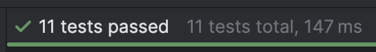

# Spendings - Kotlin Multiplatform Application

[](https://kotlinlang.org)
[](https://www.jetbrains.com/lp/compose-multiplatform/)
[](https://opensource.org/licenses/MIT)

A cross-platform spending tracker application built with Kotlin Multiplatform and Compose Multiplatform, targeting Android, and iOS platforms.

<video src="demo.mp4" controls title="Application Demo"></video>



## Project Structure
- `/app` - Shared code for all platforms
  - `commonMain` - Code shared across all platforms
  - `androidMain` - Android-specific code
  - `iosMain` - iOS-specific code
  - `desktopMain` - Desktop-specific code
- `/backend` - Backend server implementation using Ktor
- `/mcp-server` - Model Context Protocol server implementation
- `/iosApp` - iOS application entry point and SwiftUI integration

## Tech Stack
- **Kotlin Multiplatform** - Share code between platforms
- **Compose Multiplatform** - UI framework for all platforms
- **Ktor** - Networking and backend server
- **Koin** - Dependency injection
- **Voyager** - Navigation framework
- **KotlinX Serialization** - JSON serialization/deserialization
- **KotlinX Coroutines** - Asynchronous programming
- **KotlinX DateTime** - Date and time handling

## Getting Started

### Prerequisites
- JDK 17 or higher
- Android Studio Arctic Fox or higher
- Xcode 14 or higher (for iOS development)

### Building the Project
1. Clone the repository
2. Open the project in Android Studio
3. Sync Gradle files

### Android
```bash
./gradlew :app:installDebug
```

### iOS
Open the `iosApp/iosApp.xcodeproj` file in Xcode and run the project, or though Android Studio :)

### Backend Server
```bash
./gradlew :backend:run
```

### MCP Server
```bash
./gradlew :mcp-server:shadowJar
```
```json
{
  "mcpServers": {
    "spendings-mcp": {
      "command": "java",
      "args": [
        "-jar",
        "/Users/isfha/.../mcp-server/build/libs/mcp-server.jar"
      ]
    }
  }
}
```

## License
This project is licensed under the MIT License - see the LICENSE file for details.

## Learn More

- [Kotlin Multiplatform](https://www.jetbrains.com/help/kotlin-multiplatform-dev/get-started.html)
- [Compose Multiplatform](https://www.jetbrains.com/lp/compose-multiplatform/)
- [Ktor](https://ktor.io/)
- [Koin](https://insert-koin.io/)
- [Voyager](https://voyager.adriel.cafe/)